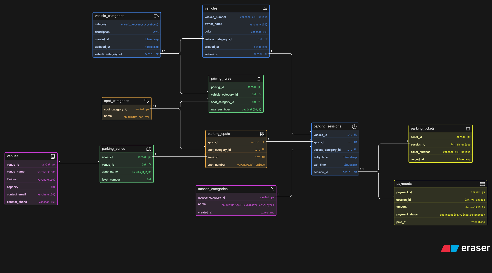

# 🚗 Comic-Con Parking System – DB Design

This project presents the database design for a **multi-zone event parking system** used in large-scale events like Comic-Con, where thousands of vehicles need to be managed efficiently.

---

## 📌 Problem Statement

A large convention venue hosts Comic-Con with multiple activities like cosplay, gaming, and exhibitions. Visitors arrive using different vehicle types, requiring a structured parking system to:

- Track vehicle entry and exit  
- Assign parking spots dynamically  
- Manage multi-zone parking areas  
- Handle reserved categories (VIP, staff, exhibitors, EV)  
- Calculate parking charges  
- Record payments and sessions  

---

## 🚀 Key Features of the Design

- Multi-zone & multi-level parking structure  
- Vehicle categorization (Bike, Car, SUV, Cab, EV)  
- Reserved parking support (VIP, Staff, Exhibitor, Cosplayer, EV)  
- Parking session tracking (entry & exit)  
- Ticket generation for each session  
- Payment tracking with status  
- Dynamic pricing based on vehicle & spot category  

---

## 🧱 Core Entities

- **vehicles** – Vehicle details  
- **vehicle_categories** – Type of vehicles  
- **parking_zones** – Zone and level structure  
- **parking_spots** – Individual parking spaces  
- **spot_categories** – Type of parking spots  
- **access_categories** – Reserved access types  
- **parking_sessions** – Entry & exit tracking  
- **parking_tickets** – Ticket details  
- **payments** – Payment records  
- **pricing_rules** – Pricing logic  

---

## 🔗 Relationships Overview

| Relationship | Type |
|-------------|------|
| Vehicle → Parking Session | 1 : M |
| Parking Spot → Parking Session | 1 : M |
| Zone → Parking Spot | 1 : M |
| Vehicle Category → Vehicle | 1 : M |
| Spot Category → Parking Spot | 1 : M |
| Session → Ticket | 1 : 1 |
| Session → Payment | 1 : 1 |

---

## 🖼️ ER Diagram

  

---

## 🧠 Design Decisions

- Used **parking_sessions** to handle multiple visits and reuse of spots  
- Separated **tickets and sessions** for better modularity  
- Introduced **pricing_rules** for flexible fee calculation  
- Used **access_categories** for reserved parking logic  
- Maintained normalized structure to avoid redundancy  

---

## 🎯 Outcome

This schema supports:

- Multiple vehicle entries across event days  
- Reusable parking spots across sessions  
- Real-time tracking of parked vehicles  
- Efficient billing and payment management  

---

## 🛠️ Tech Used

- ER Modeling (Eraser / Draw.io)  
- Relational Database Design  

---

## 💬 Feedback

Open to feedback and suggestions to improve the design!
---
